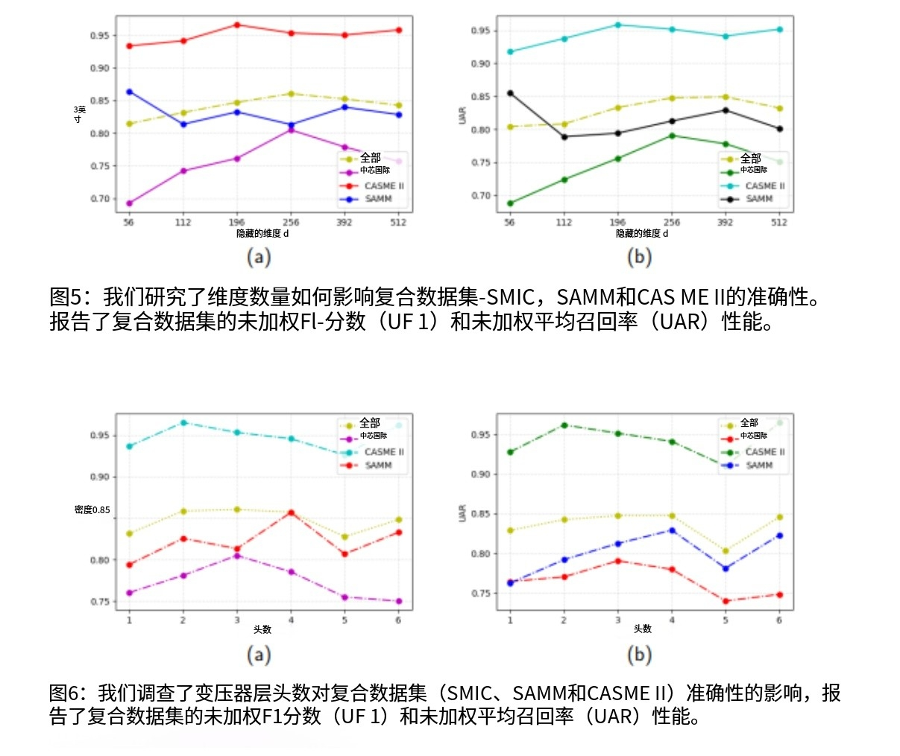

# HTNet for micro-expression recognition
[](https://paperswithcode.com/sota/micro-expression-recognition-on-casme3?p=htnet-for-micro-expression-recognition)

[](https://paperswithcode.com/sota/micro-expression-recognition-on-casme-ii-1?p=htnet-for-micro-expression-recognition)

Official implementation of our paper:  
**HTNet for micro-expression recognition**  
Zhifeng Wang, Kaihao Zhang, Wenhan Luo, Ramesh Sankaranarayana 
[[paper]](https://arxiv.org/abs/2307.14637)

A  Hierarchical Transformer Network (HTNet) to identify critical areas of facial muscle movement.
一种用于识别面部肌肉运动关键区域的分层 Transformer 网络（HTNet）。
Facial expression is related to facial muscle contractions and different muscle movements correspond to different emotional states.  For micro-expression recognition, the muscle movements are usually subtle, which has a negative impact on the performance of current facial emotion recognition algorithms.  

Most existing methods use self-attention mechanisms  to capture relationships between tokens in a sequence, but they do not take into account the inherent spatial relationships between facial landmarks. This can result in sub-optimal performance on  micro-expression recognition tasks.

Therefore, learning to recognize facial muscle movements is a key challenge in the area of micro-expression recognition.  In this paper, we propose a Hierarchical Transformer Network (HTNet) to identify critical areas of facial muscle movement.  

HTNet includes two major components: a transformer layer that leverages the local temporal features and an aggregation layer that extracts local and global semantical facial features.  Specifically, HTNet divides the face into four different facial areas: left lip area, left eye area, right eye area and right lip area.  

The transformer layer is used to focus on representing local minor muscle movement with local self-attention in each area.  The aggregation layer is used to learn the interactions between eye areas and lip areas. The experiments on four publicly available micro-expression datasets show that the proposed approach outperforms previous methods by a large margin.

面部表情与面部肌肉收缩相关，不同的肌肉运动对应着不同的情绪状态。对于微表情识别而言，肌肉运动通常很细微，这对当前的面部表情识别算法的性能产生了负面影响。

大多数现有的方法使用自注意力机制来捕捉序列中标记之间的关系，但它们没有考虑到面部关键点之间的内在空间关系。这可能导致在微表情识别任务上的性能不够理想。因此，学会识别面部肌肉运动是微表情识别领域的一个关键挑战。

在本文中，我们提出了一种分层 Transformer 网络（HTNet）来识别面部肌肉运动的关键区域。

HTNet 包括两个主要组件：一个利用局部时间特征的 Transformer 层，以及一个提取局部和全局面部语义特征的聚合层。具体来说，HTNet 将面部划分为四个不同的面部区域：左唇部区域、左眼区域、右眼区域和右唇部区域。

Transformer 层用于通过每个区域的局部自注意力来专注于表示局部的微小肌肉运动。聚合层用于学习眼部区域和唇部区域之间的相互作用。在四个公开可用的微表情数据集上进行的实验表明，所提出的方法大幅优于先前的方法。

<p align="center">
  
</p>
HTNet: Overall architectures of hierarchical transformer network for micro-expression recognition.Low-level self-attention in transformer layerscaptures fine-grained features in local regions. High-level self-attention in transformer layers captures coarse-grained features in global regions. An aggregation block isproposed to create interactions between different blocks at the same level.

HTNet：用于微表情识别的分层Transformer网络的整体架构。Transformer层中的低级自注意力捕捉局部区域的细粒度特征。Transformer层中的高级自注意力捕捉全局区域的粗粒度特征。提出了一个聚合模块，用于在同一层级的不同模块之间创建交互。

The experiments are implemented on SAMM[32], SMIC[33], CASME II[34] and CASME III [35] databases. SAMM, SMIC, and CASME II are merged into one composite dataset,and the same labels in these three datasets are adopted for micro-expression tasks. In these datasets, the “positive” emotion category includes the “happiness” emotion class, and the “negative” emotion category includes “sadness”,“disgust”, “contempt”, “fear” and “anger”
emotion classes while “surprise” emotion category only includes “surprise” class:
<p align="center">

</p>

实验在 SAMM [32]、SMIC [33]、CASME II [34] 和 CASME III [35] 数据库上进行。SAMM、SMIC 和 CASME II 被合并为一个综合数据集，并且在微表情任务中采用这三个数据集中相同的标签。在这些数据集中，“积极” 情绪类别包括 “快乐” 情绪类，“消极” 情绪类别包括 “悲伤”、“厌恶”、“轻蔑”、“恐惧” 和 “愤怒” 情绪类，而 “惊讶” 情绪类别仅包括 “惊讶” 类

The Unweighted F1-score (UF1) and Unweighted Average Recall (UAR) performance of handcraft methods, deep learning methods and our HTNet method under LOSO protocol on the composite (Full), SMIC, CASME II and SAMM. Bold text indicates the best result.

The results are listed as follows:
<p align="center">
  
</p>

在留一法（LOSO）协议下，手工方法、深度学习方法以及我们的 HTNet 方法在综合数据集（完整数据集）、SMIC、CASME II 和 SAMM 上的未加权 F1 分数（UF1）和未加权平均召回率（UAR）性能。加粗文本表示最佳结果。

We investigate the effects of the transformer layer’s head count on accuracy in composite datasetsSMIC, SAMM and CASME II. The composite datasets’ Unweighted F1-score (UF1) and Unweighted Average Recall (UAR) performance are reported.
我们研究了 Transformer 层的头数对综合数据集（SMIC、SAMM 和 CASME II）中准确率的影响。报告了综合数据集的未加权 F1 分数（UF1）和未加权平均召回率（UAR）性能。

<p align="center">

</p>

## Python code


<b>Step 1)</b> Please download the dataset and put it in /datasets

<b>Step 2)</b> Place the files in the structure as follows:
>├─datasets <br>
>--three_norm_u_v_os <br>
>--combined_datasets_whole <br>
>├─main_HTNet.py <br>
>├─requirements.txt <br>

<b>Step 3)</b> Installation of packages using pip

``` pip install -r requirements.txt ```

<b>Step 4)</b> Training and Evaluation

``` python main_HTNet.py --train True```
Python 代码
步骤 1) 请下载数据集并将其放置在 /datasets 目录下。
步骤 2) 按照以下结构放置文件：
├─datasets
--three_norm_u_v_os
--combined_datasets_whole
├─main_HTNet.py
├─requirements.txt
步骤 3) 使用 pip 安装所需的包
pip install -r requirements.txt
步骤 4) 训练和评估
python main_HTNet.py --train True

# Citation
If you find our work useful for your project, please consider citing the paper<br>
```bibtex
@article{wang2024htnet,
  title={Htnet for micro-expression recognition},
  author={Wang, Zhifeng and Zhang, Kaihao and Luo, Wenhan and Sankaranarayana, Ramesh},
  journal={Neurocomputing},
  volume={602},
  pages={128196},
  year={2024},
  publisher={Elsevier}
}
```
Thank you for your interest and support.
